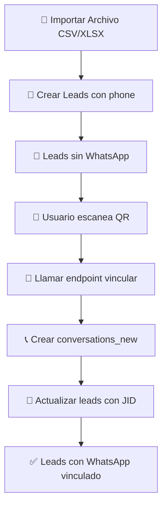

# 🔄 Guía: Flujo Completo Leads → WhatsApp

## 🎯 **Objetivo**
Permitir importar contactos como leads **antes** de tener WhatsApp vinculado, y luego **automáticamente** crear las conversaciones WhatsApp cuando se escanee el QR.

---

## 📊 **Flujo Implementado**



---

## 🗃️ **Cambios en Base de Datos**

### **Nueva Columna**
```sql
-- Columna para guardar teléfonos sin formato WhatsApp
ALTER TABLE public.leads_contacts 
ADD COLUMN IF NOT EXISTS phone TEXT;

-- Índice único para evitar duplicados
CREATE UNIQUE INDEX IF NOT EXISTS leads_contacts_user_phone_uniq
ON public.leads_contacts(user_id, phone) 
WHERE phone IS NOT NULL;
```

### **Estados de un Lead**
1. **Importado**: `phone` ✅ / `conversation_id` ❌
2. **Vinculado**: `phone` ✅ / `conversation_id` ✅

---

## 📁 **Endpoints Implementados**

### **1️⃣ POST `/api/leads/import_contacts`**
**Propósito**: Importar contactos SIN WhatsApp vinculado

```typescript
// Request
{
  "contacts": [
    { "name": "Juan Pérez", "phone": "+34612345678" },
    { "name": "María García", "phone": "34687654321" }
  ]
}

// Response
{
  "success": true,
  "created": 2,
  "skipped": 0,
  "total": 2,
  "columnId": "uuid-primera-columna",
  "message": "Importación completada: 2 contactos guardados como leads (sin WhatsApp)"
}
```

**Características:**
- ✅ Crea leads con `phone` pero sin `conversation_id`
- ✅ Evita duplicados por `user_id + phone`
- ✅ Crea primera columna automáticamente si no existe
- ✅ Usa nombre del contacto o teléfono como fallback

### **2️⃣ POST `/api/whatsapp/ensure_conversations_for_leads`**
**Propósito**: Vincular leads existentes con WhatsApp

```typescript
// Request
{
  "defaultCountry": "34"  // Código país por defecto
}

// Response
{
  "success": true,
  "created": 2,        // Conversaciones nuevas creadas
  "updated": 2,        // Leads actualizados con JID
  "fail": 0,
  "total": 2,
  "message": "Vinculación WhatsApp completada: 2 leads ahora tienen conversación de WhatsApp"
}
```

**Características:**
- ✅ Busca leads con `phone` pero sin `conversation_id`
- ✅ Normaliza teléfono a JID (`phone` → `34612345678@s.whatsapp.net`)
- ✅ Crea/actualiza `conversations_new`
- ✅ Actualiza `leads_contacts.conversation_id`

---

## 🔧 **Uso desde Frontend**

### **📥 1. Al Importar Archivo**
```javascript
async function importContacts(contacts) {
  const response = await fetch('/api/leads/import_contacts', {
    method: 'POST',
    headers: {
      'Content-Type': 'application/json',
      'Authorization': `Bearer ${userToken}`
    },
    body: JSON.stringify({ contacts })
  });

  const result = await response.json();
  
  if (result.success) {
    console.log(`✅ ${result.created} leads creados`);
    // Los leads están guardados pero SIN WhatsApp vinculado
    return result;
  } else {
    throw new Error(result.message);
  }
}
```

### **📱 2. Después del QR (WhatsApp conectado)**
```javascript
async function linkLeadsWithWhatsApp() {
  const response = await fetch('/api/whatsapp/ensure_conversations_for_leads', {
    method: 'POST',
    headers: {
      'Content-Type': 'application/json',
      'Authorization': `Bearer ${userToken}`
    },
    body: JSON.stringify({
      defaultCountry: '34' // España
    })
  });

  const result = await response.json();
  
  if (result.success) {
    console.log(`✅ ${result.updated} leads vinculados con WhatsApp`);
    // Ahora los leads tienen conversation_id y pueden recibir mensajes
    return result;
  } else {
    throw new Error(result.message);
  }
}
```

### **🔄 3. Flujo Completo Recomendado**
```javascript
// En tu componente de importación
const handleFileImport = async (file) => {
  try {
    // 1. Parsear archivo (CSV/XLSX/etc)
    const contacts = await parseFile(file);
    
    // 2. Importar como leads (sin WhatsApp)
    const importResult = await importContacts(contacts);
    
    // 3. Mostrar éxito
    setMessage(`${importResult.created} contactos importados. Se vincularán automáticamente cuando conectes WhatsApp.`);
    
    // 4. Refrescar lista de leads
    await refreshLeads();
    
  } catch (error) {
    setError('Error importando contactos: ' + error.message);
  }
};

// En tu componente de WhatsApp (después del QR)
const handleWhatsAppConnected = async () => {
  try {
    // 1. Vincular leads existentes
    const linkResult = await linkLeadsWithWhatsApp();
    
    // 2. Mostrar resultado
    if (linkResult.updated > 0) {
      setMessage(`${linkResult.updated} leads vinculados con WhatsApp`);
    }
    
    // 3. Refrescar leads (ahora con WhatsApp)
    await refreshLeads();
    
  } catch (error) {
    console.error('Error vinculando leads:', error);
  }
};
```

---

## 🔍 **Logs Detallados**

### **Importación de Contactos**
```bash
🚀 Next.js API: Importando contactos SIN WhatsApp...
📋 Procesando 3 contactos para usuario: 8ab8810d-6344-4de7-9965-38233f32671a
🔍 Buscando primera columna para usuario: 8ab8810d-6344-4de7-9965-38233f32671a
✅ Columna existente encontrada: f47ac10b-58cc-4372-a567-0e02b2c3d479
📤 Iniciando procesamiento de contactos...
✅ Lead creado: Juan Pérez (+34612345678)
✅ Lead creado: María García (34687654321)
⚠️ Teléfono ya existe, saltando: +34612345678
🎉 Importación completada: 2 creados, 1 saltados
```

### **Vinculación WhatsApp**
```bash
🚀 Next.js API: Vinculando leads con WhatsApp...
🔍 Buscando leads sin WhatsApp para usuario: 8ab8810d-6344-4de7-9965-38233f32671a
📋 Encontrados 2 leads para vincular con WhatsApp
📤 Iniciando vinculación con WhatsApp...
🔄 Procesando: Juan Pérez (+34612345678 → 34612345678@s.whatsapp.net)
✅ Conversación creada: Juan Pérez
✅ Lead vinculado: Juan Pérez → 34612345678@s.whatsapp.net
🔄 Procesando: María García (34687654321 → 34687654321@s.whatsapp.net)
✅ Conversación creada: María García
✅ Lead vinculado: María García → 34687654321@s.whatsapp.net
🎉 Vinculación completada: 2 conversaciones creadas, 2 leads actualizados, 0 fallos
```

---

## 🛡️ **Seguridad y Validaciones**

### **✅ Características de Seguridad**
- 🔒 **JWT obligatorio** en ambos endpoints
- 🛡️ **Filtrado por user_id** en todas las operaciones
- 🔍 **Validación de datos** de entrada
- 📝 **Logs detallados** para auditoría
- ⚡ **Manejo robusto de errores**

### **🚨 Validaciones Implementadas**
- ✅ Token JWT válido
- ✅ Array de contactos no vacío
- ✅ Teléfonos válidos (mínimo 7 dígitos)
- ✅ Prevención de duplicados
- ✅ Manejo de nombres vacíos

---

## 🧪 **Testing**

### **Script de Prueba**
```bash
# Ejecutar pruebas completas
node test-leads-import-whatsapp-flow.js
```

### **Pruebas Incluidas**
1. ✅ Importación de contactos sin WhatsApp
2. ✅ Vinculación con WhatsApp después del QR
3. ✅ Verificación de resultados
4. ✅ Manejo de errores y validaciones

### **Resultados Esperados**
```bash
✅ Importación exitosa: 4 creados, 1 saltados
✅ Vinculación WhatsApp exitosa: 4 conversaciones creadas, 4 leads actualizados
✅ Manejo de autenticación correcto
✅ Validación de datos vacíos correcta
```

---

## 🔧 **Configuración Requerida**

### **Variables de Entorno**
```env
JWT_SECRET=tu-jwt-secret-aqui
SUPABASE_URL=https://tu-proyecto.supabase.co
SUPABASE_SERVICE_ROLE_KEY=tu-service-role-key
```

### **Dependencias**
```bash
npm install jsonwebtoken pg @types/jsonwebtoken
```

---

## 🚨 **Solución de Problemas**

### **❌ "No autenticado"**
**Causa:** Token JWT inválido o faltante
**Solución:**
- Verificar que `JWT_SECRET` sea el mismo en ambos proyectos
- Incluir header: `Authorization: Bearer <token>`
- Verificar que el token no haya expirado

### **❌ "Teléfono ya existe"**
**Causa:** Intento de importar contacto duplicado
**Solución:** 
- Es comportamiento normal (prevención de duplicados)
- El contacto se cuenta como "saltado"

### **❌ "Phone vacío" o "Phone corto"**
**Causa:** Teléfono inválido en normalización
**Solución:**
- Verificar formato de teléfonos en archivo
- Asegurar mínimo 7 dígitos
- Usar código de país correcto

### **❌ Error de base de datos**
**Causa:** Problemas con la migración o permisos
**Solución:**
```sql
-- Verificar que la columna existe
SELECT column_name FROM information_schema.columns 
WHERE table_name = 'leads_contacts' AND column_name = 'phone';

-- Verificar índice único
SELECT indexname FROM pg_indexes 
WHERE tablename = 'leads_contacts' AND indexname = 'leads_contacts_user_phone_uniq';
```

---

## 📈 **Ventajas del Flujo Implementado**

### **✅ Para el Usuario**
- 📁 **Importa contactos inmediatamente** (sin esperar WhatsApp)
- 🔄 **Vinculación automática** cuando conecta WhatsApp
- 📱 **Sin pérdida de datos** si WhatsApp se desconecta
- 🎯 **Nombres se preservan** correctamente

### **✅ Para el Desarrollador**
- 🛡️ **Separación de responsabilidades** (leads vs WhatsApp)
- 🔄 **Estado consistente** en base de datos
- 📝 **Logs detallados** para debugging
- ⚡ **Manejo robusto** de errores

### **✅ Para el Sistema**
- 🚀 **Performance mejorada** (no bloquea por WhatsApp)
- 🔒 **Seguridad robusta** (JWT + user_id filtering)
- 📊 **Escalabilidad** (procesa lotes grandes)
- 🔄 **Idempotencia** (puede ejecutarse múltiples veces)

---

## 🎉 **¡Sistema Completo Implementado!**

**Ahora tienes un flujo robusto que permite:**
1. ✅ **Importar contactos** antes de tener WhatsApp
2. ✅ **Vincular automáticamente** después del QR
3. ✅ **Evitar duplicados** y errores 401
4. ✅ **Preservar nombres** correctamente
5. ✅ **Manejar errores** gracefully

¡El sistema está listo para producción! 🚀
