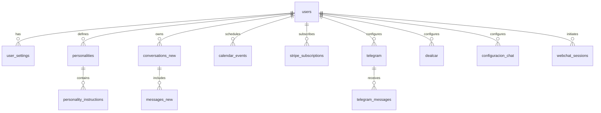

# Documentación del Backend

Bienvenido a la documentación del backend del proyecto Uniclick.

## Instalación

### Prerrequisitos

- Node.js >= 14.x
- npm o yarn
- PostgreSQL (para desarrollo)

### Instalación de dependencias

```bash
npm install
```

### Construcción

```bash
npm run build
```

### Ejecución

- **Desarrollo**: `npm run dev`
- **Producción**: `npm start`

## Configuración

Crea un archivo `.env` en la raíz con:

```dotenv
NODE_ENV=development
PORT=5001FRONTEND_URL=http://localhost:3000
BACKEND_URL=http://localhost:5001SESSION_SECRET=your_session_secret
JWT_SECRET=your_jwt_secret
OPENAI_API_KEY=your_openai_api_key
GOOGLE_CLIENT_ID=your_google_client_id
GOOGLE_CLIENT_SECRET=your_google_client_secret
SUPABASE_URL=your_supabase_url
SUPABASE_SERVICE_ROLE_KEY=your_supabase_service_role_key
```

Revisa `env.d.ts` para tipos de las variables.

## Estructura del proyecto

El código transpila a `dist`. Estructura:

```
.
├── Dockerfile
├── env.d.ts
├── fix-imports.js
├── package.json
├── test-whatsapp-backend.js
├── tsconfig.json
└── dist
    ├── app.js
    ├── config
    ├── controllers
    ├── routes
    ├── services
    ├── utils
    ├── sockets
    ├── public
    ├── logo
    └── credentials
```

## Configuración de módulos

Archivos en `dist/config`:

| Archivo       | Descripción                             |
|-------------- |-----------------------------------------|
| db.js         | Pool de PostgreSQL                      |
| jwt.js        | Middleware de JWT                       |
| deepseek.js   | Integración DeepSeek                    |
| openai.js     | Configuración de OpenAI                 |
| stripe.js     | Configuración de Stripe                 |
| vision.js     | Configuración de Google Vision          |

## API HTTP

Todas las rutas (salvo indicación) requieren `Authorization: Bearer <token>`.

### Globales

| Método | Ruta                     | Descripción                                        |
|-------:|--------------------------|----------------------------------------------------|
| POST   | `/api/saveCalendarToken` | Guarda token de calendario en sesión de WhatsApp    |
| POST   | `/api/transcribe-audio`  | Transcribe audio (Whisper)                         |

### Autenticación (`/api`)

| Método | Ruta                   | Descripción                   |
|-------:|------------------------|-------------------------------|
| POST   | `/register`            | Registra un nuevo usuario     |
| POST   | `/login`               | Inicia sesión                 |
| GET    | `/user`                | Datos del usuario             |
| PUT    | `/user/update_profile` | Actualiza perfil              |
| POST   | `/invite`              | Invita por email              |

### Calendario (`/api/calendar`)

| Método | Ruta        | Descripción                      |
|-------:|-------------|----------------------------------|
| POST   | `/bulk`     | Inserta múltiples eventos        |
| GET    | `/`         | Obtiene eventos del usuario      |
| DELETE | `/:eventId` | Elimina un evento por ID         |

### Stripe (`/api/stripe`)

| Método | Ruta                       | Descripción                                  |
|-------:|----------------------------|----------------------------------------------|
| POST   | `/create-checkout-session` | Sesión de Stripe Checkout (suscripción)      |
| POST   | `/create-payment-link`     | Crea un Payment Link                         |
| POST   | `/create-portal-session`   | Sesión del portal de facturación             |
| POST   | `/cancel-subscription`     | Cancela suscripción                          |
| POST   | `/webhook`                 | Webhook de Stripe (raw JSON)                 |

### Webhook Stripe

| Método | Ruta                  | Descripción                          |
|-------:|-----------------------|--------------------------------------|
| POST   | `/api/stripe/webhook` | Manejador raw de eventos de Stripe   |

### Chat Config (`/api/configuracion-chat` y `/api/configuracion-chatPersonal`)

| Método | Ruta                 | Descripción                       |
|-------:|----------------------|-----------------------------------|
| POST   | `/saveConfiguration` | Guarda configuración de chat      |
| GET    | `/userConfiguration` | Obtiene configuración del usuario |

### Personalidades (`/api/personalities`)

| Método | Ruta                                  | Descripción                                  |
|-------:|---------------------------------------|----------------------------------------------|
| POST   | `/transcribe-audio`                   | Transcribe audio y asocia a personalidad     |
| GET    | `/all`                                | Lista todas las personalidades               |
| POST   | `/create_personality`                 | Crea nueva personalidad                      |
| POST   | `/edit_personality`                   | Edita personalidad                           |
| POST   | `/instructions`                       | Agrega instrucciones                         |
| POST   | `/test-context`                       | Prueba contexto de personalidad              |
| GET    | `/getbyid/:id`                        | Obtiene personalidad por ID                  |
| POST   | `/delete/:id`                         | Elimina personalidad por ID                  |
| POST   | `/get_personalities_instructions`     | Obtiene instrucciones de personalidades      |
| POST   | `/update_personality_instruction`     | Actualiza instrucción de personalidad        |
| POST   | `/delete_personality_instruction`     | Elimina instrucción de personalidad          |
| GET    | `/:id/saludo`                         | Obtiene saludo de personalidad               |
| POST   | `/set_global`                         | Establece personalidad global                |
| GET    | `/get_global`                         | Obtiene personalidad global                  |

### Chat (`/api`)

| Método | Ruta                            | Descripción                             |
|-------:|---------------------------------|-----------------------------------------|
| GET    | `/get_conversations`           | Lista conversaciones                    |
| GET    | `/get_messages`                | Obtiene mensajes de una conversación    |
| POST   | `/delete_conversation`         | Elimina conversación                    |
| POST   | `/set_conversation_personality` | Asigna personalidad a conversación      |

### WhatsApp (`/api/whatsapp`)

| Método | Ruta                                | Descripción                               |
|-------:|-------------------------------------|-------------------------------------------|
| GET    | `/get_contact/:id`                  | Info de un contacto                       |
| GET    | `/get_conversations`                | Lista conversaciones WhatsApp             |
| GET    | `/get_messages`                     | Mensajes de conversación                  |
| POST   | `/send_message`                     | Envía mensaje a conversación existente    |
| POST   | `/send_message_to_number`           | Envía mensaje a número específico         |
| POST   | `/update_contact_preferences`       | Actualiza preferencias de contacto        |
| GET    | `/get_user_messages_count`          | Cuenta mensajes de usuario                |
| GET    | `/get_ai_messages_count`            | Cuenta mensajes generados por IA          |
| POST   | `/activate_global_ai_all`           | Activa IA global                          |
| POST   | `/activate_global_personality`      | Activa personalidad global                |
| POST   | `/set_conversation_personality`     | Establece personalidad de conversación    |
| POST   | `/set_contact_personality_boolean`  | Flag de personalidad en contacto          |
| POST   | `/set_conversation_prohibition`     | Define prohibiciones globales             |
| POST   | `/set_default_personality`          | Define personalidad por defecto           |
| POST   | `/unread`                           | Marca como leída                          |

### Sesiones (`/api/sessions`)

| Método | Ruta             | Descripción                          |
|-------:|------------------|--------------------------------------|
| GET    | `/`             | Lista sesiones activas               |
| DELETE | `/:sessionId?`  | Elimina una o todas las sesiones     |

### Webchat Config (`/api/webchat-config`)

| Método | Ruta           | Descripción                          |
|-------:|----------------|--------------------------------------|
| GET    | `/:projectId`  | Obtiene configuración de webchat     |
| POST   | `/chat-response`| Envía mensaje a API de webchat      |

### Webchat Chats (`/api/WebchatChats`)

| Método | Ruta    | Descripción                         |
|-------:|---------|-------------------------------------|
| GET    | `/all`  | Lista sesiones de webchat           |
| GET    | `/`     | Mensajes de sesión específica       |

### Contador (`/api/contador`)

| Método | Ruta                | Descripción                          |
|-------:|---------------------|--------------------------------------|
| GET    | `/all_users`        | Total de usuarios registrados        |
| GET    | `/all_users_per_day`| Usuarios registrados hoy             |

### DealCar (`/api/dealcar`)

| Método | Ruta           | Descripción                           |
|-------:|----------------|---------------------------------------|
| POST   | `/save_config` | Guarda configuración de DealCar       |
| POST   | `/getCoches`   | Obtiene stock de vehículos            |

### Dominio (`/api/dominio`)

| Método | Ruta                | Descripción                         |
|-------:|---------------------|--------------------------------------|
| POST   | `/create-subdomain` | Crea registro CNAME                 |
| POST   | `/check-subdomain`  | Verifica existencia de subdominio   |

### Feedback (`/api/feedback`)

| Método | Ruta      | Descripción                           |
|-------:|-----------|---------------------------------------|
| POST   | `/feedback`| Envía feedback con archivos adjuntos  |

### Telegram (`/api/telegram`)

| Método | Ruta             | Descripción                         |
|-------:|------------------|-------------------------------------|
| POST   | `/save_config`   | Guarda configuración de Telegram    |
| POST   | `/set_webhook`   | Configura webhook de Telegram       |
| POST   | `/save_messages` | Guarda mensajes de Telegram         |

### User Settings (`/api`)

| Método | Ruta                               | Descripción                            |
|-------:|------------------------------------|----------------------------------------|
| GET    | `/user_settings`                   | Obtiene preferencias del usuario       |
| PATCH  | `/user_settings/global_ai`         | Establece IA global                    |
| PATCH  | `/user_settings/default_personality`| Establece personalidad por defecto    |

## Servicios

Ubicados en `dist/services`:

- openaiService.js: Transcripción y consultas a OpenAI
- whatsappService.js: Socket.IO y WhatsApp Web
- googleVisionService.js: Google Cloud Vision
- googleService.js: Autenticación y tokens de Google
- calendarService.js: Google Calendar
- personalityService.js: Personalidades e instrucciones
- sessionsService.js: Sesiones de Supabase
- stripeService.js: Stripe
- userSettingsService.js: Configuración de usuario
- conversationService.js: Conversaciones

## Utilidades

Ubicadas en `dist/utils`:

- fileUtils.js: Manejo de archivos
- fileUtilsWhatsapp.js: Archivos de WhatsApp
- jwtUtils.js: JWT
- whatsappUtils.js: WhatsApp

## WebSockets

Para pruebas de socket de WhatsApp:

```bash
node test-whatsapp-backend.js
```

Maneja eventos `qr-code`, `session-ready`, `session-closed` y `error-message`.

## Base de Datos

La conexión a PostgreSQL se configura en `dist/config/db.js` usando `pg.Pool` y variables de entorno.

A continuación se describen las tablas principales del sistema y sus campos relevantes:

| Tabla                     | Descripción                                  | Campos relevantes                                                                                   |
|---------------------------|----------------------------------------------|-----------------------------------------------------------------------------------------------------|
| users                     | Usuarios del sistema                         | id (PK), full_name, username, email, role, password_hash, created_at, updated_at                     |
| user_settings             | Preferencias de usuario (IA global y pers.)   | id (PK), user_id (FK→users.id), default_personality_id (FK→personalities.id), ai_global_active, updated_at |
| personalities             | Personalidades definidas por el usuario       | id (PK), users_id (FK→users.id), nombre, empresa, sitio_web, posicion, instrucciones, saludo, category, avatar_url, time_response, created_at, updated_at |
| personality_instructions  | Instrucciones asociadas a cada personalidad   | id (PK), users_id, personality_id (FK→personalities.id), instruccion, created_at                     |
| conversations_new         | Conversaciones de WhatsApp Web               | id (PK), user_id (FK→users.id), external_id, contact_name, contact_photo_url, started_at, wa_user_id |
| messages_new              | Mensajes de WhatsApp Web                     | id (PK), conversation_id (FK→conversations_new.id), user_id, sender_type, message_type, text_content, interactions, created_at |
| calendar_events           | Eventos de calendario                        | id (PK), user_id (FK→users.id), event_date, start_time, end_time, title                              |
| stripe_subscriptions      | Suscripciones de Stripe                      | auth_uid (PK), subscription_id                                                                       |
| telegram                  | Configuración de bot de Telegram              | id (PK), user_id (FK→users.id), username, token, first_name, last_name, language_code, last_message, created_at, updated_at |
| telegram_messages         | Mensajes recibidos de Telegram                | id (PK), user_id (FK→users.id), telegram_chat_id, message_text, sender_name, date_received           |
| dealcar                   | Configuración de integración DealCar          | id (PK), user_id (FK→users.id), numero_api, numero_apikey                                            |
| configuracion_chat        | Configuración del widget de chat interno      | id (PK), user_id (FK→users.id), bot_name, bot_description, theme_color, welcome_message, personality_id, model, avatar_url, placeholder, chat_layout, message_style, offline_message, thanks_message, feedback_buttons, file_upload, typing_indicator, script, projectId, created_at, updated_at |
| webchat_sessions          | Sesiones y mensajes de Webchat                | session_id (PK), project_id, user_id, start_time, messages (JSONB), status, last_message, bot_name, avatar_img, chat_session_id, created_at, updated_at |

## Diagrama ER



## Archivos Estáticos

- `/webchat.js`: Widget del Webchat
- `/public/stripe.html`: Stripe Checkout
- `/success` y `/cancel`: Páginas de pago
- `/uploads`: Directorio de archivos subidos

## Despliegue

### Docker

```bash
 docker build -t uniclick-backend .
 docker run -d \
   --name uniclick-backend \
   -p 5001:5001 \
   --env-file .env \
   uniclick-backend
```

### Manual

```bash
npm run build
npm start
```
